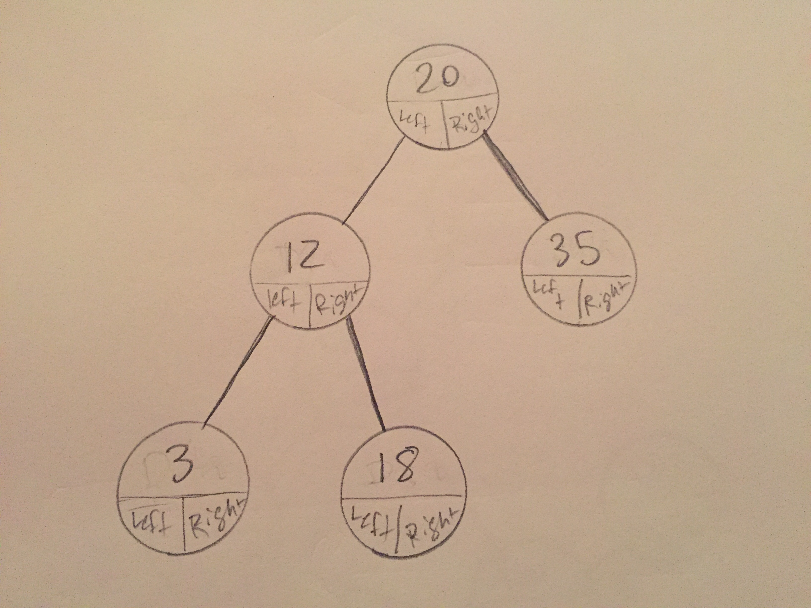

# Binary Search Trees

Binary Search Tree (bst) is an implementation of the tree ADT. A bst operates off of some specific rules. The tree will always add values smaller than the parent node to the left side of the tree and larger values to the right.

# In Memory

In memory, a binary search tree looks like this:



You can see the tree is made of nodes which contain data and references to the left and right child.

# Operations

* **Accessing/Searching for data:** Gets a piece of data stored in the tree. **O(log n)**: a bst by nature takes a divide and conquer approach to storing data. As you traverse down the tree to access a piece of data, you leave behind half the tree of data as you already know if the data will be on one side of the tree or another due to the binary tree rule. Every time you move down a level you continue to cut the data set in half making this process logarithmic in nature.
* **Insert:** Inserting into a binary search tree is a lot like inserting into a linked list. **O(1)** is the amount of time it takes to change the references of the nodes as those are just constnat operations. However, getting to the node will increase the time to **O(log n)**, the same time as accessing and searching.
* **Remove:** Removing ends up being very similar to inserting. **O(log n)**: while the removal itself is **O(1)**, traversing to the node to remove is the same process as searching and accessing.

# Use Cases

Binary Search Tree is a great way to sort enormous amounts of data with comparable values as you can access, insert, and remove data with ease. Some implementations like AVL trees (trees which balance themselves to avoid being too long on one side or another) further simplify the time it takes to perform actions on data.

If the information you're trying to store is not easily comparable, a bst will not be the best option.

# Example

```

#create a new tree with root 10
test_bst = bst(10)

#insert some items
test_bst.insert(12)
test_bst.insert(6)
test_bst.insert(4)
test_bst.insert(32)
test_bst.insert(11)

#tree will now contain:
#           10
#       6        12
#     4       11    32
#

```

[Prev](trees_overview.md) | [Next](heap.md)

[Front Page](README.md)

(c) 2018 Michael Tornatta. All rights reserved.
