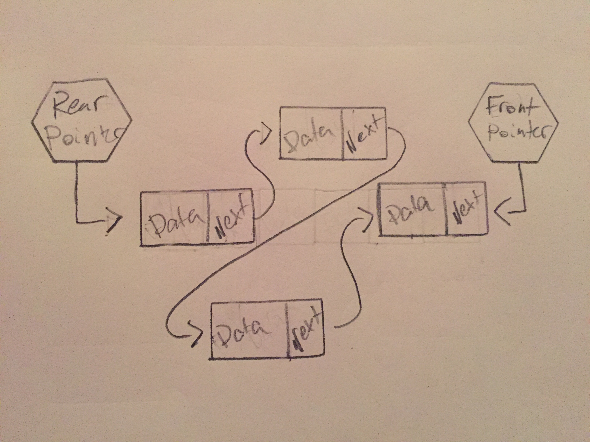

# Deques

A deque is a linear structure that functions as a double ended queue. That means items can be added to both the "front" and the "read" of the structure.

# In Memory

In memory, a deque looks like this:



A deque is implemented in a virtually identical way to a queue, the difference lies in the way the deque is interacted with. Unlike a queue where you can only enqueue and dequeue to the rear and front, respectively, a deque can add to the front and rear and remove from the front and rear.

# Operations

* **Add to Front/Rear:** Adds a piece of data to either the front or rear of the deque **O(1)**: Since the deque keeps track of the rear and the front, you just need to add a piece of data before or after that element. When using a linked list implementation, this is simple as you just need to perform some constant operations to change the reference of the rear or front element and pointer.
* **Remove from Front/Read:** Removes a piece of data from either the front or rear of the deque **O(1)**: removing is also a constant action in a deque as the front and rear are kept track of with pointers. You simply need to remove and return an element after the front element or before the rear element and change the reference of the corresponding pointer.
* **Accessing Specific Data:** Deques, like queues, are also not really meant to be used for finding a specific piece of data within it. If you wanted to find a piece of data you would have to remove elements until you found it in the deque. **O(n)**: since you have to remove items to find a specific element, the time it takes is dependent on how many elements there are in the deque.

# Use Cases

A deque is useful when you need a sort of mix between a queue and a stack. Something like a word processor's undo functionality can be implemented nicely with a queue.

Much like stacks and queues, however, deques are not very good at accessing data inside the structure so would not be good for any purpose requiring data access from the middle of a collection of information.

# Example

```

#create a  with initial value
test_deque = deque(10)

#add some elements
test_deque.addFront(12)
test_deque.addRear(15)
#deque now contains 15,10,12

#remove element from rear
removed = test_deque.removeRear()
#removed is now 15

```

[Prev](queue.md) | [Next](hash_table.md)

[Front Page](README.md)

(c) 2018 Michael Tornatta. All rights reserved.
