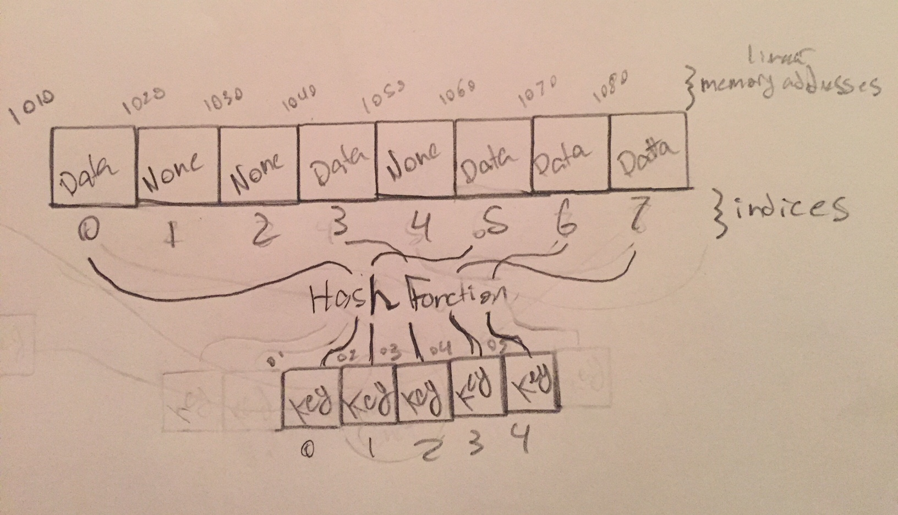

# Dictionaries

A dictionary is a unordered and indexed structure. It stores data which is mapped to a key through the use of a hashing function.

# In Memory

In memory, a dictionary looks like this:



Dictionaries are implemented through the use of a hash table. Keys are hashed to get to the location of the corresponding data.

# Operations

* **Search:** Looks for a piece of data within a dictionary. **O(1)**: a dictionary can check if it contains an item through the use of hashing. Since that's just performing an operation, searching works in constant time.
* **Get:** Gets data stored in the dictionary through use of a key. **O(1)**: data is gotten through the use of hashing. Again, since hashing is just performing an operation, get performs in constant time.
* **Set:** Sets the value of a piece of data at the indexed mapped to a key. **O(1)**: a dictionary will use hashing to get to the data to set. Again, hashing is an operation so setting will run at constant time.
* **Delete:** Removes a piece of data at index mapped to a key. **O(1)**: deleting will also run at constant time since the item to delete can also be found through hashing.

# Use Cases

Dictionaries are especially helpful when cataloguing or when needing to know if a piece of data belongs to a data set.

If data is needing to be manipulated or ordered in a certain way, dictionaries may not be the best match.

# Example

```
#creating a dictionary with values and keys
test_dictionary = {12345:"terrible password", 3154645:"less terrible password"}

#add an item with key
test_dictionary[402138] = "getting better"

#access item
item = test_dictionary[12345]
#item is now "terrible password"

```

[Prev](tuple.md) | [Next](linked_list.md)

[Front Page](README.md)

(c) 2018 Michael Tornatta. All rights reserved.
