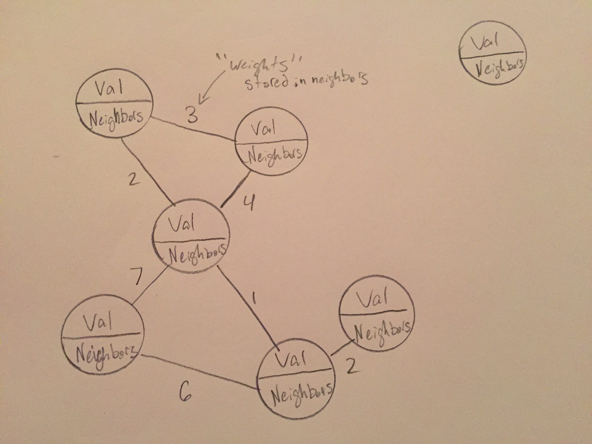

# Graphs

A \[widget\] is \[describe in very simple terms\].

# In Memory

In memory, a graph looks like this:



\[description of diagram\]

# Operations

A \[widget\] supports the following operations:

* name: description, Big O efficiency, and explain why / what that means
* name: description, Big O efficiency, and explain why / what that means

# Use Cases

An \[widget\] is useful \[when\] \[why\].

It is not as good as \[what] \[why\].

# Example

```
sample code showing creation, and exercising all of the operations
or
a program that doesn't use the structure, and then a version that does
```

[Prev](priority_queue.md) | [Return to Front Page](README.md)

(c) 2018 Michael Tornatta. All rights reserved.
