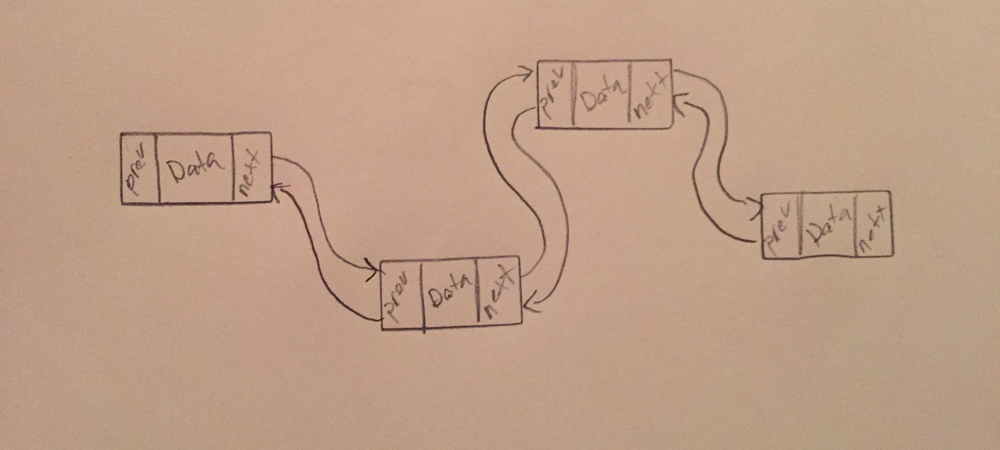

# Linked Lists

A linked list is a linear structure comprised of objects know as "Nodes". Each node contains a piece of data and a reference to the next and sometimes previous node in the list.

# In Memory

In memory, a linked list looks like this:



You can see it doesn't really matter where the nodes "exist" in space, it only matters that they have a reference to the next and, in this example of a doubly linked list, previous node in the list.

# Operations

* **Access:** Retrieves data from the linked list **O(n)**: a linked list does not keep track of where data is within it using indices. Therefore, it must iterate through itself to retrieve data, meaning the time it will take to perform an access will be directly tied to how large the linked list is.
* **Search:** Looks for a piece of data within a linked list. **O(n)**: a linked list needs to iterate through itself to locate a certain piece of data. This means the speed of the search is directly tied to the size of the linked list.
* **Insert:** Inserts a piece of data after a specified node. **O(1)**: a linked list excels when it comes to insertion speeds. It only needs to perform a sequence of operations to set the references of the adjacent nodes to tie them to the newly inserted node and dereference each other. Although insertion itself is constant, the process of finding the data to insert after is still **O(n)**.
* **Remove:** Removes a piece of data from the linked list. **O(1)**: this operation is similar to insert. It simply has to perform a sequence of operations to dereference the object to be removed and link the node adjacent to the removed node to each other. Again, while removal itself is constant, the process of finding the node to delete is still **O(n)**.

# Use Cases

A linked list is great as an alternative to something like an array when you're unsure of how much data may need to be added to a data set or if you need fast insertion or deletion times.

Linked lists can be less helpful when you need quick access to a piece of data in the middle of the list or if you need an indexed structure.

# Example

```

#creating a linked list with default value 20
list = node(20);

#add 40 to the end of the linked list
list.add(40)

#insert 10 after 20 in the linked list
list.insert(10,20)

#remove 40 from the linked list
list.remove(40)

```

[Prev](dictionary.md) | [Next](stack.md)

[Front Page](README.md)

(c) 2018 Michael Tornatta. All rights reserved.
