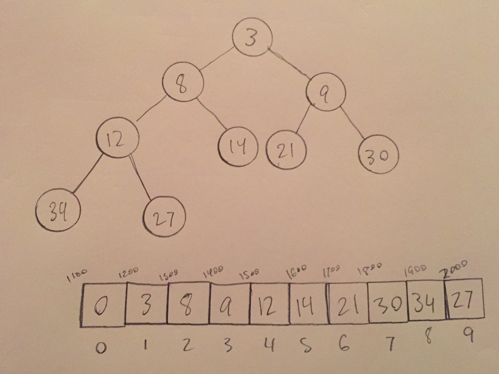

# Priority Queue

Priority queues are a certain implementation of a queue where "priorities" are assigned to values being queued up. Items with a higher priority are accessed before other queued items regardless of when they were inserted.

# In Memory

In memory, a priority queue looks like this:



One way of implementing a priority queue is with a heap, which has a structure that lends itself nicely to this ADT. Since min or max values percolate to the top of the heap, you could say that this is the value's "priority". This structure naturally allows for the highest priority item to be removed from the "front" of the queue.

# Operations

* **Insert with Priority:** Adds data to the queue. The highest priority item will move the front of the queue. **O(log n)**: a new piece of data is added left to right on the lowest level of the heap tree. The rules of the heap must then be followed and the data will percolate to the correct position. This is proportional to the size of the heap but since the heap is still a tree, the problem is cut in half with each percolation making the time logarithmic.
* **Remove Highest Priority Item:** Removes an element from the heap. **O(log n)**: deletion removes a specified element from the heap then readjusts the heap so it follows its internal rules. Like adding, this is dependent on the size of the heap but the problem is broken into parts due to the tree structure of this ADT.

# Use Cases

An \[widget\] is useful \[when\] \[why\].

It is not as good as \[what] \[why\].

# Example

```

#create new priority queue
test_pqueue = pqueue()

#add some items (priority, data)
test_pqueue.add(3, "Item 1")
test_pqueue.add(4, "Item 2")
test_pqueue.add(6, "Item 3")

#add a high priority item
test_pqueue.add(1, "Item 4")
#this item is now at the front of the priority queue

#Get the highest priority item
high_priority = test_pqueue.getMax()
#this will now equal "Item 4"

```

[Prev](heap.md) | [Next](graphs.md)

[Front Page](README.md)

(c) 2018 Michael Tornatta. All rights reserved.
