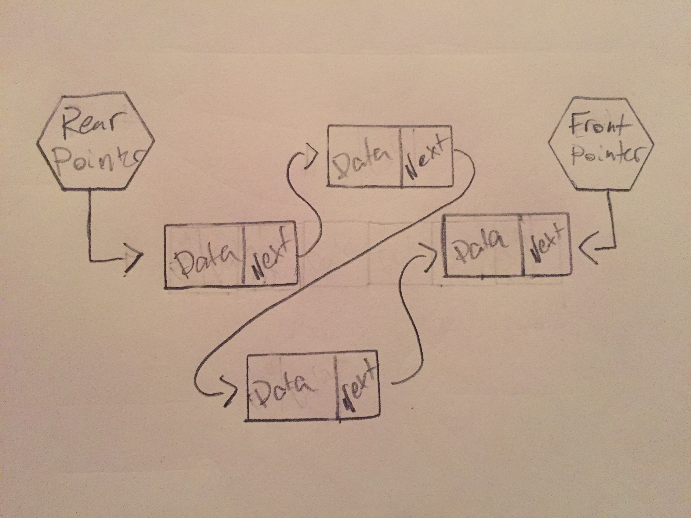

# Queues

A queue is a linear data structure that stores information in **First in first out** (FIFO) order. Information is "enqueued" into the "rear" of the queue, and "dequeued" from the "front" of the queue.

# In Memory

In memory, a queue looks like this:



This queue is being represented by a linked list. It keeps track of the rear and front through the use of pointers.

# Operations

* **Enqueue:** Adds a piece of data to the rear of the queue **O(1)**: Since the queue keeps track of the rear, you just need to add a piece of data before that element. When using a linked list implementation, this is simple as you just need to perform some constant operations to change the reference of the rear element and pointer.
* **Dequeue:** Removes a piece of data from the front of the queue **O(1)**: dequeueing is also a constant action in a queue as the front is also kept track of with a pointer. You simply need to remove and return an element after the front element and change the reference of the front pointer.
* **Accessing Specific Data:** Queues, like stacks, are not really meant to be used for finding a specific piece of data within it. If you wanted to find a piece of data you would have to dequeue elements until you found it in the queue. **O(n)**: since you have to dequeue to find a specific element, the time it takes is dependent on how many elements there are in front of the desired item in the queue.

# Use Cases

Queues are helpful when you want to keep track of elements in a FIFO order. There are a variety of applications from printer queues to keeping track of computers trying to access a server.

Queues are great for purposes that work well with FIFO structure, but are not good for data collections where you need to access information held within the structure. Arrays are better for this purpose.

# Example

```

#create a new queue with intial value
test_queue = queue("User 1")

#enqueue some items
test_queue.enqueue("User 2")
test_queue.enqueue("User 3")
test_queue.enqueue("User 4")

#dequeue element
dequeued = test_queue.dequeue()
#dequeued is now "User 1"

```

[Prev](stack.md) | [Next](deque.md)

[Front Page](README.md)

(c) 2018 Michael Tornatta. All rights reserved.
