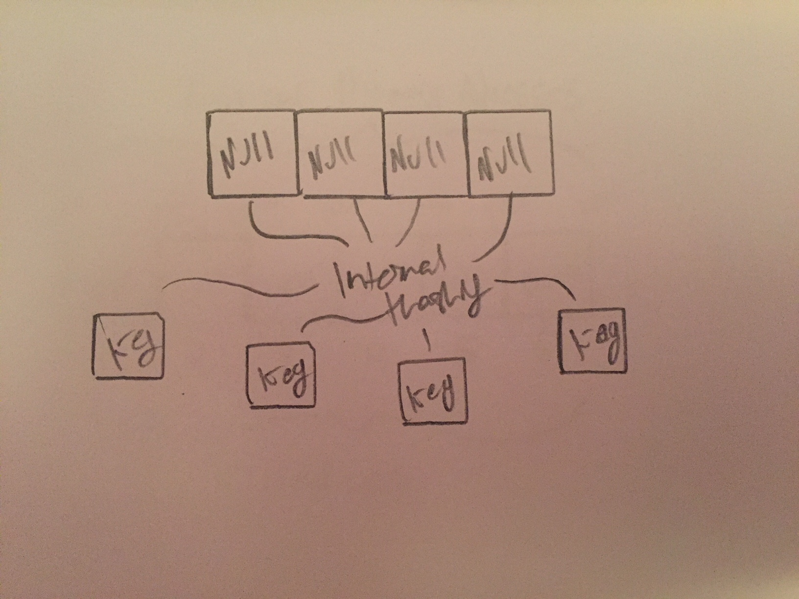

# Sets

Sets are unordered structures and contain items which are immutable. Sets themselves can be immutable when implemented as frozen sets. Unlike lists, sets do not keep items at a particular index. They also can contain no data duplicates.

# In Memory

In memory, a set looks like this:



Sets can be and are implemented in python using [hash tables](hash_table.md) but are more limited than hash tables as they focus only on the key value and leave the data values null. This creates an unordered structure that also does not allow for duplicates as two keys of the same value will hash to the same place.

# Operations

* **Access:** Has to loop through the whole structure to access. **O(n)**: a set is unordered and unindexed so it must loop through itself looking for whatever value is needing to be accessed. That means the time it will take when accessing data will grow proportionally with the size of the data set.
* **Search:** Looks for a piece of data within a set. **O(n)**: a set will again have to iterate through itself to find the value it's looking for. Though seeing if the value exists in the set is only **O(1)**.
* **Add:** Adds a piece of data to the set. **O(1)**: a set can add data at constant time as it just needs to perform an operation to store the key.
* **Remove:** Removes a piece of data from the set. **O(1)**: the removing of the data will happen at a constant time. However, finding the data to be deleted will perform at **O(n)**

# Use Cases

Set is most useful if you are trying to remove duplicates from a collection of data or if you need to just check to see if a piece of data is in your stored data set.

It's a fairly limited ADT so it would not perform well against other more dynamic structures.

# Example

```
#creating a set
test_set = {"one", "two", "three"}
#this set, if displayed, would display these items in a random order

#adding an item
test_set.add("four")

#remove an item
test_set.remove("two")
```

[Prev](list.md) | [Next](tuple.md)

[Front Page](README.md)

(c) 2018 Michael Tornatta. All rights reserved.
