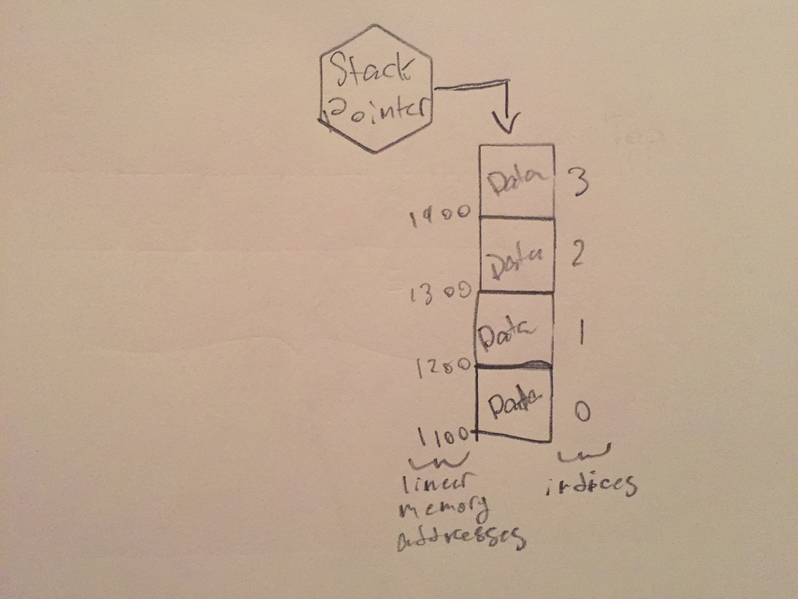

# Stacks

A stack is a linear structure that stores and retrieves information in **Last in First out** (LIFO) order. This means that the last piece of information to be placed in the structure is the first one to be retrieved.

# In Memory

In memory, a stack looks like this:



The stack in this drawing is being implemented through an array. You "push" (the stack version of adding or appending) data onto the "top" (the last element) of the stack, and "pop" data off the top of the stack to retrieve it. The top of the stack is kept track of through the use of a stack pointer.

# Operations

* **Peek:** Looks at the top element of the stack but does not remove it from the stack. **O(1)**: Since you simply need to return the value at the stack pointer you only need to perform a simple, constant operation.
* **Push:** Adds a piece of data to the top of the stack. **O(1)**: you just need to add a piece of data to the end of the structure then change the stack pointer reference to be the newly added element. Since this only requires some simple operations, the time it takes is constant.
* **Pop:** Removes the piece of data at the top of the stack. **O(1)**: again, this operation relies on the stack pointer. It removes the data referenced by the pointer then changes the pointer reference to be the element below the popped element.
* **Accessing/Popping to Specific Data:** Stacks are not really meant to be used for finding a specific piece of data within it. If you wanted to find a piece of data you would have to pop elements until you found it in the stack. **O(n)**: since you have to pop through the stack to find a specific element, the time it takes is dependent on how many elements there are above the element you're wishing to access.

# Use Cases

Stack is helpful when you are doing something that requires you to keep track of and reference the last item added to a data set. They are implemented within other abstract data types like [graphs](graphs.md) to keep track of nodes being traversed.

Stacks are not great to use if you're wanting to access elements in the middle of the data set. For that you'd be better off sticking with an array.

# Example

```

#create a stack with initial value
test_stack = stack(10)
#top is 10

#push some items to the stack
test_stack.push(30)
test_stack.push(12)
test_stack.push(55)

#sets peek to top stack item without popping from stack
peek = test_stack.peek()
#peek is now 55, the top is still 55

#pop the item from the top of the stack and return the value
popped = test_stack.pop()
#popped is now 55, the top is now 12

```

[Prev](linked_list.md) | [Next](queue.md)

[Front Page](README.md)

(c) 2018 Michael Tornatta. All rights reserved.
