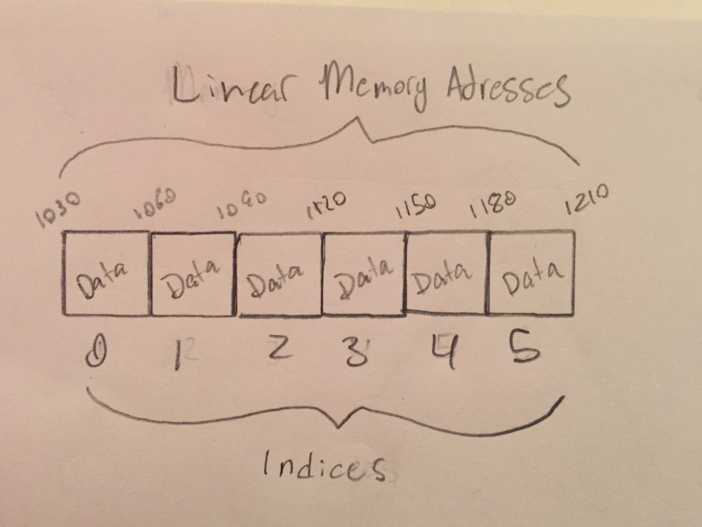

# Tuples

A tuple is an ordered and immutable structure. It's very similar to a list, it just cannot be changed.

# In Memory

In memory, a tuple looks like this:



A tuple is stored as an array in memory. The limitations come in how you can interact with the structure.

# Operations

* **Access:** Gets data stored at a specified position. **O(1)**: a tuple is ordered and therefore keeps track of where data was entered within it. All it needs to do is perform a calculation to jump to the correct index.
* **Search:** Looks for a piece of data within a tuple. **O(n)**: a tuple does not know the data contained at each index so it will have to search itself entirely to find a specific value. This means the search has the potential take longer and longer the larger the tuple is.

# Use Cases

A tuple is useful if you need a collection of data that you never want to have changed. They can be use to store dictionary keys as their values will never change.

A tuple, like a set, is fairly limited in its applications and is really only useful for very specific purposes.

# Example

```
#create a tuple
test_tuple = ("cat", "dog", "snake")

#access a tuple element by index
item = test_tuple[1]
#item is now "dog"

```

[Prev](set.md) | [Next](dictionary.md)

[Front Page](README.md)

(c) 2018 Michael Tornatta. All rights reserved.
